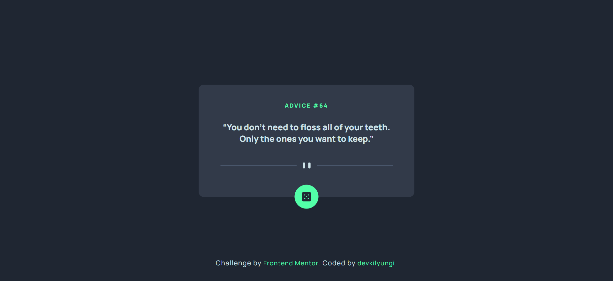
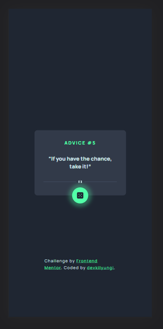

# Frontend Mentor - Advice generator app solution

This is a solution to the [Advice generator app challenge on Frontend Mentor](https://www.frontendmentor.io/challenges/advice-generator-app-QdUG-13db). Frontend Mentor challenges help you improve your coding skills by building realistic projects.

## Table of contents

- [Overview](#overview)
  - [The challenge](#the-challenge)
  - [Screenshot](#screenshot)
  - [Links](#links)
- [My process](#my-process)
  - [Built with](#built-with)
  - [What I learned](#what-i-learned)
  - [Continued development](#continued-development)
  - [Useful resources](#useful-resources)
- [Author](#author)

## Overview

### The challenge

My challenge was to build out this advice generator app using the [Advice Slip API](https://api.adviceslip.com) and get it looking as close to the design as possible.

Ideally, users should be able to:

- View the optimal layout for the app depending on their device's screen size
- See hover states for all interactive elements on the page
- Generate a new piece of advice by clicking the dice icon

### Screenshot

### Desktop View

### Mobile View

### Links

- Live Site URL: [Github Page](https://devkilyungi.github.io/advice-generator-app-main/)

## My process

- I first created the card as a 'div' element. Inside the card there are four sections.
- The advice-id is positioned at the top, followed by the advice-text, then a pattern divider, and finally a button.
- I used the absolute position property in conjunction with a translate property on both the x and y axis to center the card and the attribution.
- I also used flexbox to make the card layout a bit flexible.
- For logic I made use of JavaScript's async/await feature to fetch data from the adviceslip API. I then used an event listener to listen for clicks and perform reset or loading of new advice to the DOM elements.

### Built with

- Semantic HTML5 markup
- CSS custom properties
- Flexbox
- JavaScript Vanilla

### What I learned

- I had my first real encounter with promises using modern JS. Wrapping my head around the objects returned and how to access them was my biggest challenge and learning point.

### Continued development

- To further enhance my skills as a JavaScript Developer, I will dive deeper into promises and networking components to better understand how communication on the web works.

### Useful resources

- [Async/await](https://javascript.info/async-await) - This helped me get a basic understanding of promises. I really liked this since it is comfortable to use, and relatively easy to understand. I will use it going forward.

## Author

- Twitter - [@devkilyungi](https://www.twitter.com/devkilyungi)
